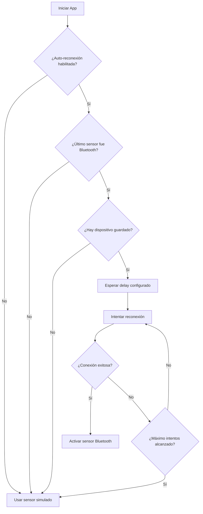

# 🔄 Guía de Reconexión Automática - PlayeraCap

## 📋 Descripción General

La funcionalidad de **Reconexión Automática** permite que la aplicación se conecte automáticamente al último dispositivo Bluetooth conocido cuando se inicia la aplicación, mejorando significativamente la experiencia del usuario al eliminar la necesidad de reconectar manualmente cada vez.

## 🎯 **Nueva Funcionalidad: Memoria de Tipo de Sensor**

### **¿Qué hace?**
- **Guarda automáticamente** el tipo de sensor seleccionado (Simulado o Bluetooth)
- **Restaura automáticamente** el tipo de sensor al abrir la aplicación
- **Mantiene la configuración** entre sesiones de la aplicación

### **Comportamiento:**
- **Si cerraste en modo Simulado** → Se abre en modo Simulado (NO se ejecuta reconexión automática)
- **Si cerraste en modo Bluetooth** → Se abre en modo Bluetooth Y se ejecuta reconexión automática
- **Si no hay dispositivo Bluetooth guardado** → Se abre en modo Simulado por defecto

## 🚀 Características Principales

### ✅ **Funcionalidades Implementadas**

1. **Guardado Automático de Dispositivos**
   - Cuando te conectas a un dispositivo Bluetooth, la aplicación guarda automáticamente su información
   - Se almacena: dirección MAC, nombre del dispositivo y tiempo de conexión

2. **Reconexión Automática al Iniciar**
   - Al abrir la aplicación, se intenta reconectar automáticamente al último dispositivo
   - **Solo se ejecuta si el último tipo de sensor guardado fue Bluetooth**
   - Si el último sensor fue Simulado, NO se ejecuta reconexión automática
   - Delay configurable (por defecto 2 segundos)
   - Máximo 3 intentos de reconexión

3. **Memoria de Tipo de Sensor**
   - Guardado automático del tipo de sensor seleccionado (Simulado/Bluetooth)
   - Restauración automática al iniciar la aplicación
   - Fallback inteligente a modo simulado si no hay dispositivo Bluetooth guardado

3. **Reconexión por Pérdida de Conexión**
   - Si se pierde la conexión durante el uso, se intenta reconectar automáticamente
   - Solo funciona si el sensor está activo y es de tipo Bluetooth

4. **Configuración Flexible**
   - Habilitar/deshabilitar reconexión automática
   - Configurar delay entre intentos
   - Limpiar dispositivo guardado

## 🎯 Cómo Usar

### **1. Configuración Inicial**

1. Ve a la pantalla **"Sensor"** en la aplicación
2. Selecciona **"Bluetooth"** como tipo de sensor
3. Busca y conecta tu dispositivo ESP32
4. La aplicación guardará automáticamente la información del dispositivo

### **2. Reconexión Automática**

#### **Al Iniciar la Aplicación:**
- La reconexión automática se ejecuta automáticamente
- Verás logs en el Logcat con el prefijo `MainViewModel`
- Si es exitosa, el sensor se activará automáticamente

#### **Durante el Uso:**
- Si se pierde la conexión, se intentará reconectar automáticamente
- El proceso es transparente para el usuario

### **3. Configuración Manual**

#### **En la Pantalla de Sensor:**
- **Sección "Reconexión Automática"**
  - Ver información del último dispositivo conectado
  - Botón "Reconectar ahora" para reconexión manual
  - Botón "Limpiar dispositivo guardado" para eliminar datos
  - Botón "🧪 Probar Reconexión Automática" para pruebas

#### **En la Pantalla de Inicio:**
- **Sección "Estado de Reconexión Automática"**
  - Ver estado actual (habilitada/deshabilitada)
  - Habilitar/deshabilitar reconexión automática
  - Botón "Reconectar" para intento manual

## 🔧 Configuración Técnica

### **Preferencias Almacenadas:**
```kotlin
// Dispositivo guardado
"last_connected_device_address" -> String (dirección MAC)
"last_connected_device_name" -> String (nombre del dispositivo)
"last_connection_time" -> Long (timestamp de conexión)

// Configuración de reconexión
"auto_reconnect_enabled" -> Boolean (habilitada por defecto)
"auto_reconnect_delay" -> Long (2000ms por defecto)
```

### **Parámetros de Reconexión:**
- **Máximo intentos**: 3
- **Delay por defecto**: 2000ms (2 segundos)
- **Delay configurable**: 1000ms - 10000ms

## 🧪 Pruebas y Diagnóstico

### **Herramienta de Pruebas Integrada:**
1. Ve a la pantalla **"Sensor"**
2. Busca la sección **"Reconexión Automática"**
3. Presiona **"🧪 Probar Reconexión Automática"**
4. Revisa los logs en Logcat con el prefijo `AutoReconnectTest`

### **Logs de Diagnóstico:**
```bash
# Reconexión automática
MainViewModel: 🚀 Iniciando reconexión automática al arrancar la app
MainViewModel: 🔄 Intento de reconexión #1 a AA:BB:CC:DD:EE:FF
MainViewModel: ✅ Reconexión exitosa

# Pruebas
AutoReconnectTest: 🧪 Iniciando simulación de reconexión automática
AutoReconnectTest: ✅ Prueba de almacenamiento exitosa
```

## ⚠️ Consideraciones Importantes

### **Permisos Requeridos:**
- `BLUETOOTH_SCAN`
- `BLUETOOTH_CONNECT`
- `ACCESS_FINE_LOCATION`
- `ACCESS_COARSE_LOCATION`

### **Limitaciones:**
- Solo funciona con dispositivos Bluetooth (no con sensor simulado)
- Requiere que el dispositivo esté en rango y disponible
- La reconexión puede fallar si el dispositivo está ocupado

### **Solución de Problemas:**

#### **No se reconecta automáticamente:**
1. Verifica que la reconexión automática esté habilitada
2. Confirma que hay un dispositivo guardado
3. Asegúrate de que el dispositivo esté en rango
4. Revisa los logs para errores específicos

#### **Reconexión falla repetidamente:**
1. Limpia el dispositivo guardado
2. Conecta manualmente al dispositivo
3. Verifica que el dispositivo funcione correctamente
4. Reinicia la aplicación

## 🔄 Flujo de Trabajo Típico



## 📱 Interfaz de Usuario

### **Indicadores Visuales:**
- **Verde**: Reconexión automática habilitada
- **Rojo**: Reconexión automática deshabilitada
- **Información del dispositivo**: Nombre, MAC y tiempo de conexión

### **Botones Disponibles:**
- **Habilitar/Deshabilitar**: Cambiar estado de reconexión automática
- **Reconectar**: Intento manual de reconexión
- **Limpiar**: Eliminar dispositivo guardado
- **Probar**: Ejecutar pruebas de diagnóstico

---

## 🎉 Beneficios

1. **Experiencia de Usuario Mejorada**: No más reconexiones manuales
2. **Automatización**: Proceso transparente y confiable
3. **Configuración Flexible**: Control total sobre el comportamiento
4. **Diagnóstico Integrado**: Herramientas de prueba incluidas
5. **Robustez**: Múltiples intentos y manejo de errores

¡La reconexión automática hace que tu experiencia con PlayeraCap sea mucho más fluida y profesional! 🚀
